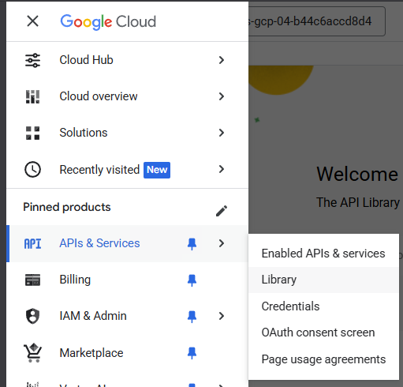
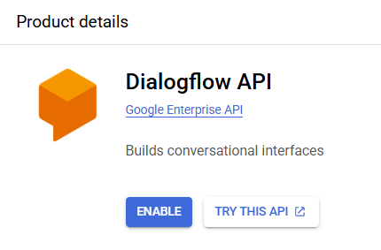

# A Tour of Google Cloud Hands-on Labs

Welcome to the **A Tour of Google Cloud Hands-on Labs** project!  
This introductory-level lab provides hands-on experience with Google Cloud, focusing on exploring the Cloud Console, managing projects, working with IAM roles, enabling APIs, and understanding lab environments via Google Cloud Skills Boost (powered by Qwiklabs).

## Lab Details

- **Duration**: 45 minutes
- **Cost**: Free
- **Level**: Introductory
- **Platform**: Google Cloud Skills Boost (Qwiklabs)

## Objectives

By completing this lab, you will learn how to:
- Access the Google Cloud console using temporary lab credentials.
- Explore Google Cloud projects and understand their structure.
- Use the navigation menu to discover Google Cloud services.
- Manage IAM roles and permissions with Cloud IAM.
- Enable and explore Google Cloud APIs using the API library.

## Lab Outline

### 1. Access the Cloud Console
- Start the lab session and sign into the Cloud Console with provided temporary credentials.
- Understand the role of the Lab Details pane (Username, Password, Project ID).

### 2. View and Understand Projects
- Locate the current project information (Project ID, Project Number, Name).
- Explore multiple projects, including the special "Qwiklabs Resources" project.

### 3. Navigate Google Cloud Services
- Use the Navigation menu to browse categories of Google Cloud products.

### 4. Manage Roles and Permissions
- View existing IAM roles.
- Grant a "Viewer" role to another user.

### 5. Enable APIs and Services
- Search for and enable the **Dialogflow API**.
- Learn to access API documentation through the API Library.

### 6. End the Lab
- End the lab session to terminate the temporary environment and submit feedback.

## Key Concepts

- **Temporary Environment**: Labs provide isolated, time-limited projects.
- **IAM (Identity and Access Management)**: Control who can access and modify Google Cloud resources.
- **APIs**: Enable services for programmatic access and integration.
- **Activity Tracking**: Monitor task completion for scoring and credential validation.

## Useful Links
- [Google Cloud Skills Boost](https://www.cloudskillsboost.google/)
- [Google Cloud Products Overview](https://cloud.google.com/products)
- [Google Cloud APIs Explorer](https://developers.google.com/apis-explorer)

## Requirements
- No prior Google Cloud experience needed.
- Recommended for beginners starting their Google Cloud journey.