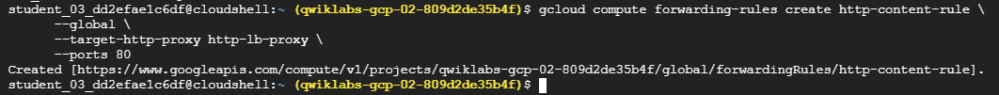

# Implement Load Balancing on Compute Engine: Challenge Lab

## Overview

This project demonstrates a solution to the **Implement Load Balancing on Compute Engine: Challenge Lab**. The objective is to provision resources that support an HTTP Load Balancer in front of a managed instance group running Nginx web servers, and to configure a jumphost instance for administrative access.

## Tasks Summary

1. Set default region and zone.
2. Create a jumphost instance.
3. Set up a startup script to install and configure Nginx.
4. Create an instance template using the startup script.
5. Create a managed instance group.
6. Configure firewall rules.
7. Create a health check.
8. Create a backend service and attach the instance group.
9. Configure URL map and proxy.
10. Set up forwarding rule.

---

## Task 1: Create a Project Jumphost Instance

You will use this instance to perform maintenance for the project.
Requirements:
• Name the instance Instance name.
• Create the instance in the ZONE zone.
• Use an e2-micro machine type.
Use the default image type (Debian Linux).

### Assign Veriables

```bash
export INSTANCE=
export FIREWALL=
export ZONE=
export REGION="${ZONE%-*}"
```

```bash
gcloud compute instances create $INSTANCE \
    --zone=$ZONE \
    --machine-type=e2-micro
```


---

## Task 2: Set Up an HTTP Load Balancer

You will serve the site via nginx web servers, but you want to ensure that the environment is fault-tolerant. Create an HTTP load balancer with a managed instance group of 2 nginx web servers. Use the following code to configure the web servers; the team will replace this with their own configuration later.

### Create Startup Script

This script will install and start Nginx, and customize the default index page.

```bash
cat << EOF > startup.sh
#! /bin/bash
apt-get update
apt-get install -y nginx
service nginx start
sed -i -- 's/nginx/Google Cloud Platform - '"\$HOSTNAME"'/' /var/www/html/index.nginx-debian.html
EOF
```

---

### Create an Instance Template

```bash
gcloud compute instance-templates create web-server-template \
        --metadata-from-file startup-script=startup.sh \
        --machine-type e2-medium \
        --region $REGION
```


---

### Create a Managed Instance Group

```bash
gcloud compute instance-groups managed create web-server-group \
        --base-instance-name web-server \
        --size 2 \
        --template web-server-template \
        --region $REGION
```


---

### Create Firewall Rule

Allow HTTP traffic to reach the instances.

```bash
gcloud compute firewall-rules create $FIREWALL \
        --allow tcp:80 \
        --network default
```


---

### Create a Health Check

```bash
gcloud compute http-health-checks create http-basic-check
```


---
### Group Named ports 80

```bash
gcloud compute instance-groups managed \
        set-named-ports web-server-group \
        --named-ports http:80 \
        --region $REGION
```


---
### Create a Backend Service

```bash
gcloud compute backend-services create web-server-backend \
        --protocol HTTP \
        --http-health-checks http-basic-check \
        --global
```


---

### Add Instance Group to Backend

```bash
gcloud compute backend-services add-backend web-server-backend \
        --instance-group web-server-group \
        --instance-group-region $REGION \
        --global
```


---

### Create a URL Map

```bash
gcloud compute url-maps create web-server-map \
        --default-service web-server-backend
```


---

### Create Target HTTP Proxy

```bash
 
gcloud compute target-http-proxies create http-lb-proxy \
        --url-map web-server-map
```


---

---

### Create Forwarding Rule

```bash
gcloud compute forwarding-rules create http-content-rule \
      --global \
      --target-http-proxy http-lb-proxy \
      --ports 80
```


---

gcloud compute forwarding-rules list

---

## Conclusion

You have successfully implemented an HTTP Load Balancer in front of a managed instance group, using GCP best practices for resource provisioning and configuration. This lab demonstrates your ability to build scalable and reliable cloud infrastructure using Google Cloud Platform.

```

---
