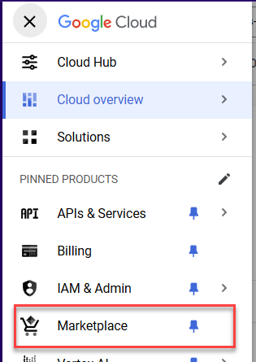
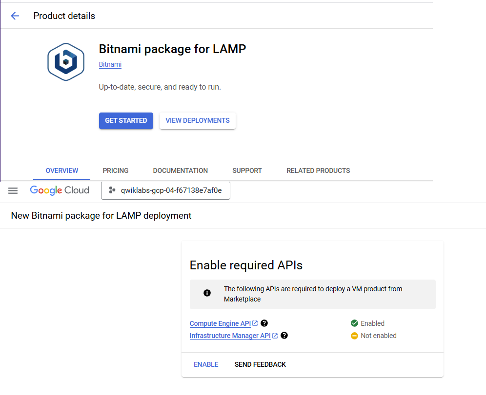
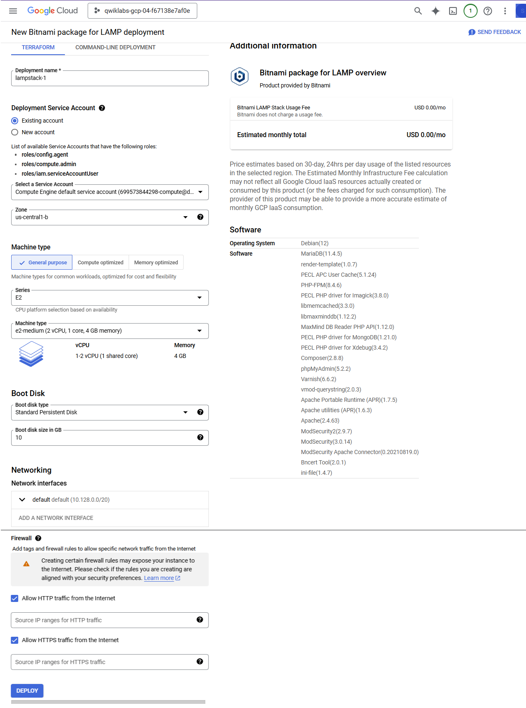
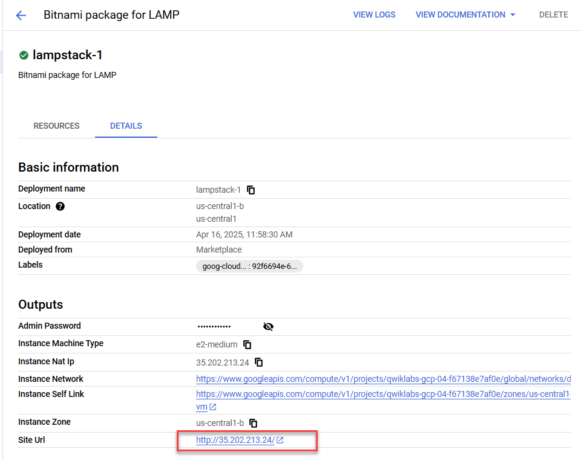
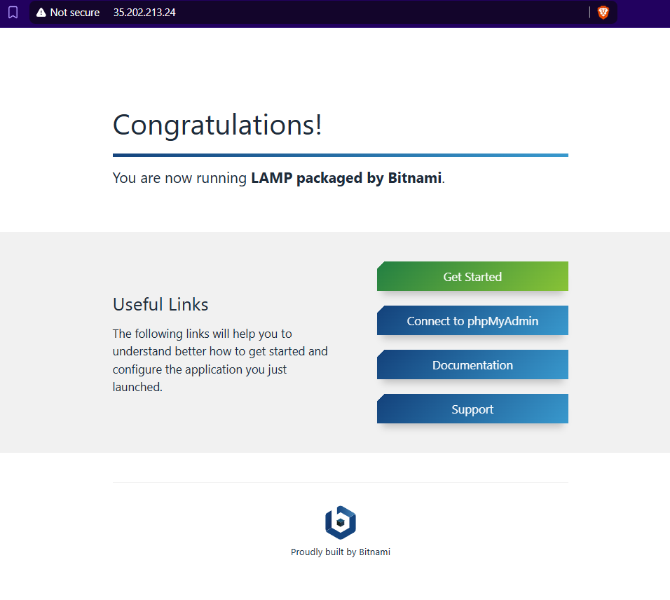

# 🚀 Google Cloud Fundamentals: Getting Started with Cloud Marketplace

Welcome to the **Google Cloud Marketplace LAMP Stack Deployment Lab**! This experiment is designed to introduce you to Google Cloud Marketplace and help you deploy a LAMP stack (Linux, Apache, MySQL, PHP) on a Google Compute Engine instance using the Bitnami package.

---

## 🧪 Lab Details

- **Type:** Hands-on Lab / Experiment  
- **Duration:** ~25 minutes  
- **Cost:** 5 Credits (Free tier available with temporary credentials)  
- **Level:** Introductory  
- **Tools:** May incorporate AI to assist learning  

---

## 📚 Overview

In this lab, you'll use **Google Cloud Marketplace** to quickly deploy a **LAMP stack** using Bitnami on a Compute Engine VM. This setup provides a full development environment, ideal for beginners exploring cloud-based hosting and web development.

### 🧩 Components

| Component       | Role                          |
|----------------|-------------------------------|
| Linux           | Operating system               |
| Apache HTTP     | Web server                     |
| MySQL           | Relational database            |
| PHP             | Web application framework      |
| phpMyAdmin      | PHP-based database admin tool  |

Learn more about the [Bitnami LAMP stack](https://docs.bitnami.com/google/infrastructure/lamp/) on Google Cloud.

---

## 🎯 Objectives

By completing this lab, you will:

- Launch a solution from the Google Cloud Marketplace
- Deploy and verify a fully functional LAMP stack
- Access a live web server running on a VM

---

## 📝 Tasks

### ✅ Task 1: Sign in to the Google Cloud Console

1. Click `Start Lab` to activate your temporary GCP credentials.
2. Open the Google Cloud Console using the provided credentials.
3. **Important:** Use only the provided temporary credentials—**do not** use your personal Google account.
4. Accept all terms and skip account recovery setup.

> 💡 Tip: Arrange your tabs side-by-side for easier navigation.

---

### ✅ Task 2: Deploy a LAMP Stack from Cloud Marketplace

1. In the Console, go to **Navigation Menu > Marketplace**.

2. Search for **LAMP** and select **Bitnami package for LAMP**.
3. Click **Get Started**, agree to terms, then click **Deploy**.

4. Configure:
   - **Zone:** Choose any available zone (e.g., `us-central1-a`)
   - **Machine Type:** `E2` Series → `e2-medium`
5. Leave the rest as defaults and click **Deploy**.

6. Wait for `lampstack-1 has been deployed` confirmation.

---

### ✅ Task 3: Verify Your Deployment

1. In the Console, navigate to:  
   `Deployments > lampstack-1 > Details`
2. Click the **Site URL**.

3. A new tab should show a **Congratulations** page, confirming Apache is live.

> ⚠️ If you can't access the site:
> - Wait 30 seconds and retry.
> - Disable any corporate VPN or firewall.
> - Try from a different device (mobile or tablet).

---

## 🎉 Congratulations!

You’ve successfully deployed a complete LAMP stack via **Google Cloud Marketplace**! This setup is ideal for exploring web hosting, development, or testing on cloud infrastructure.

---

## 📌 Notes

- This lab uses **temporary credentials** valid only during the session.
- Make sure to **not use your own GCP account** to avoid charges.
- The deployed environment includes a pre-configured Apache server, MySQL, PHP, and phpMyAdmin—perfect for beginner web projects.

---

## 📎 Resources

- [Google Cloud Marketplace](https://console.cloud.google.com/marketplace)
- [Bitnami LAMP Documentation](https://docs.bitnami.com/google/infrastructure/lamp/)
- [Google Cloud Training Labs](https://www.cloudskillsboost.google)

---
