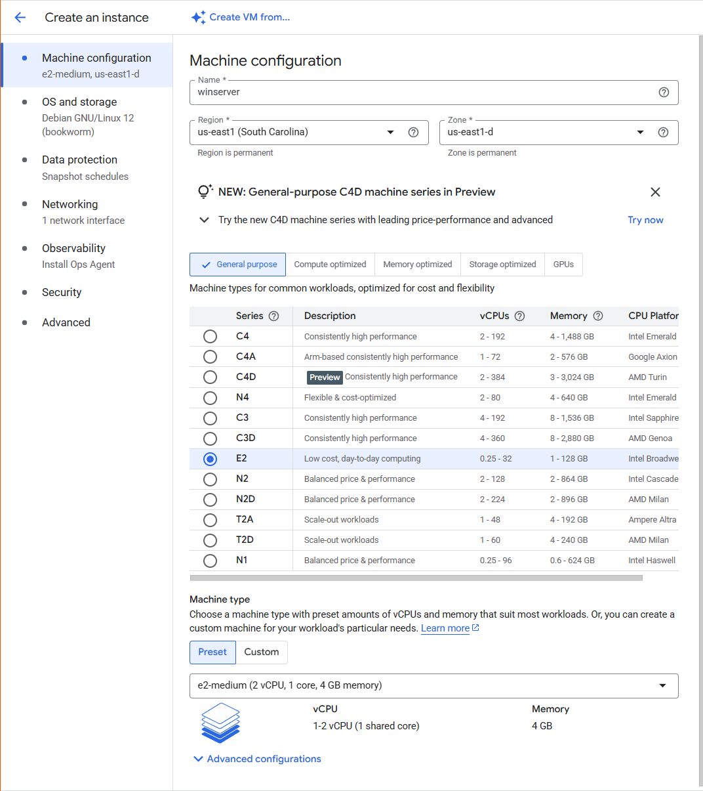
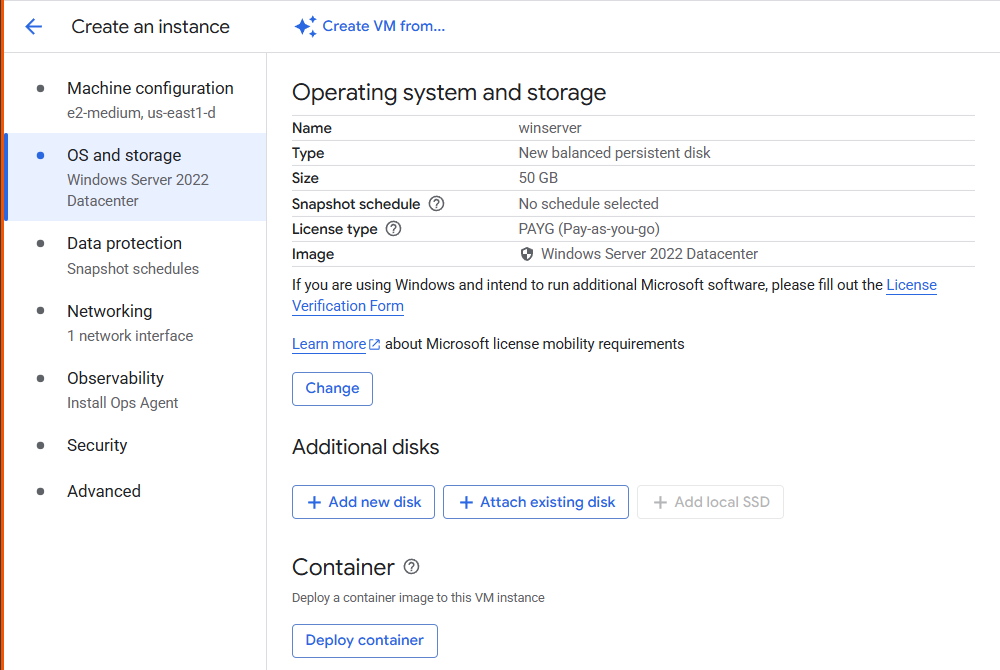
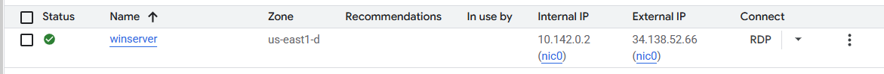
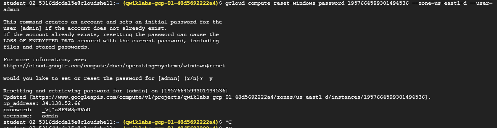
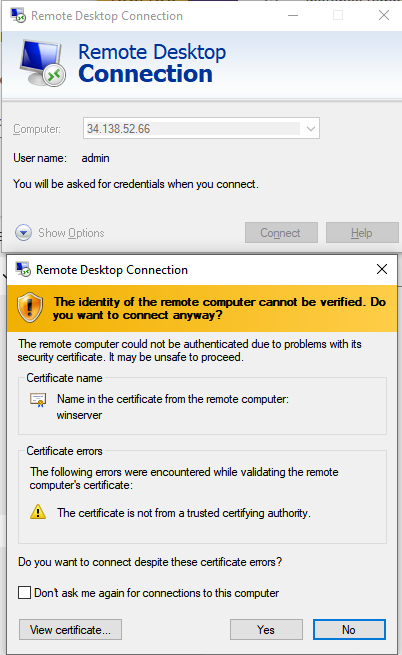
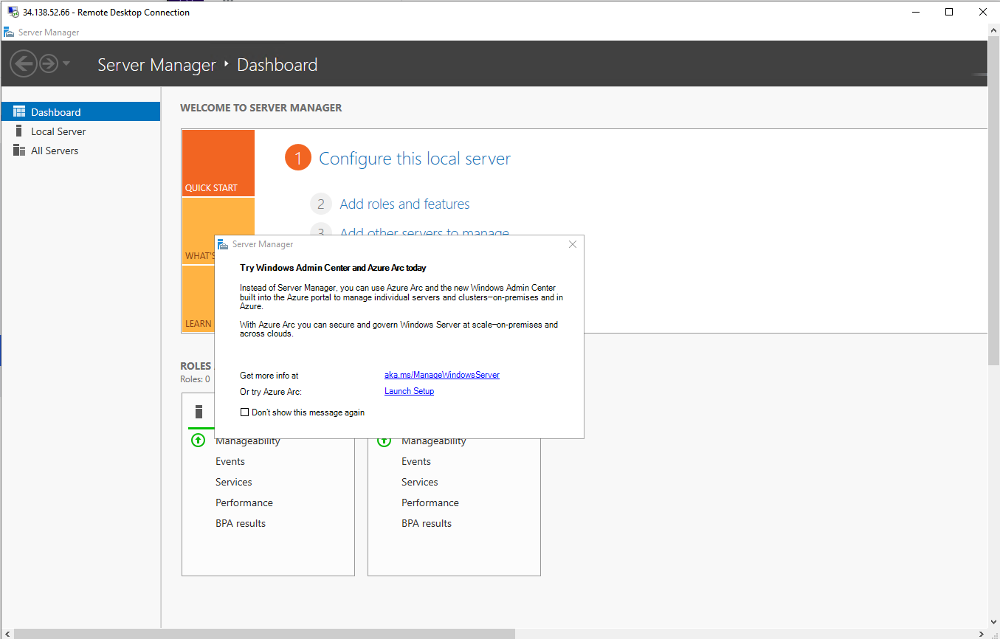

# Google Cloud Compute Engine: Launching Windows Server and RDP Access

## Overview

Google Cloud Compute Engine lets you create and run virtual machines on Google's infrastructure. It provides high performance, scalability, and flexibility, allowing you to easily launch large compute clusters.

With Compute Engine, you can run Windows applications on virtual machines and take advantage of features such as reliable storage, the speed of Google's network, and Autoscaling.

In this hands-on project, you'll learn how to:
- Launch a Windows Server instance in Google Cloud
- Use Remote Desktop Protocol (RDP) to connect to it

---

## Activate Cloud Shell

Cloud Shell provides CLI access to Google Cloud with pre-installed tools and a 5GB persistent disk.

To activate:
1. Click the **Activate Cloud Shell** icon at the top of the console.
2. Authorize API access.
3. Cloud Shell will connect and set your project ID automatically.

You can verify the active account:
```bash
gcloud auth list
````

And check the project ID:

```bash
gcloud config list project
```

---

## Creating a Windows VM Instance

1. Go to **Compute Engine > VM Instances > Create Instance**.

2. Configure as follows:

   * **Region**: `<REGION>`
   * **Zone**: `<ZONE>`
   * **Series**: `E2`

3. Under **OS and Storage**, click **Change** and set:

   * **Operating System**: Windows Server
   * **Version**: Windows Server 2022 Datacenter

4. Click **Create**.






---

## Check VM Readiness for RDP

Once the instance is created, it takes time for the OS to fully initialize.

Run this command to check readiness (replace `[instance]` and `ZONE`):

```bash
gcloud compute instances get-serial-port-output [instance] --zone=us-east1-d
```

Repeat until you see:

```
------------------------------------------------------------
Instance setup finished. instance is ready to use.
------------------------------------------------------------
```

---

## Connect via RDP

1. Set your password:

```bash
gcloud compute reset-windows-password [instance] --zone=us-east1-d --user=admin
```


2. Use the generated password to log in via:

   * Native RDP client (Windows)
   * Spark View (Chrome extension)
   * macOS RDP tools (e.g., Microsoft Remote Desktop or CoRD)

Use the **external IP address** of your VM for connection.




---

## Tips

* **Copy/Paste** in RDP:

  * Use `Ctrl + V` (Mac: `Command + V` won't work in Windows Server)
  * In PuTTY, right-click to paste

---

## 🎉 Congratulations!

You’ve successfully:

* Created a Compute Engine virtual machine with a Windows image
* Connected to it using RDP
