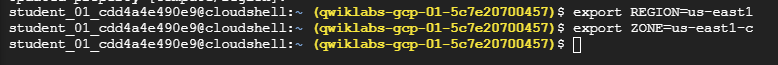

# Google Cloud Compute Engine: VM Deployment with NGINX

## Overview

This repository documents a hands-on lab demonstrating how to create and manage Virtual Machine (VM) instances using **Google Cloud Compute Engine**. You will learn to create VMs via both the **Google Cloud Console** and the **gcloud command-line tool**, deploy an **NGINX** web server, and understand how to configure regions, zones, and firewall rules.

## Objectives

- Create a VM using the Google Cloud Console.
- Create a VM using the gcloud CLI in Cloud Shell.
- Deploy and validate a working NGINX web server.
- Understand how to work with regions, zones, and firewall rules.

## Prerequisites

- Basic knowledge of Linux and terminal editors (e.g., `nano`, `vim`, `emacs`)
- Access to a modern browser (Chrome in Incognito mode recommended)
- A temporary **Qwiklabs** student account or Google Cloud account (charges may apply if not using Qwiklabs)

## Lab Setup and Requirements

- Lab is time-limited and cannot be paused.
- Temporary credentials will be provided to access Google Cloud.
- Use only the provided student credentials to avoid charges.

## Instructions

### 1. Activate Google Cloud Shell

1. Click **Activate Cloud Shell** in the Google Cloud Console.


2. Run the following to configure region and zone:

```bash
gcloud config set compute/region us-east1
export REGION=us-east1
export ZONE=us-east1-c
```


---

### 2. Create a VM Using Google Cloud Console

1. Navigate to: **Compute Engine > VM Instances**
2. Click **Create Instance** and configure the following:

| Field          | Value                    |
|----------------|--------------------------|
| Name           | `gcelab`                 |
| Region         | `us-east1`               |
| Zone           | `us-east1-c`             |
| Series         | `E2`                     |
| Machine Type   | `e2-medium`              |
| Boot Disk      | `Debian GNU/Linux 11`    |
| Disk Type      | `Balanced persistent disk (10 GB)` |
| Firewall       | ✅ Allow HTTP traffic     |

3. Click **Create** to launch the VM.
4. After creation, click SSH next to the instance to connect.
---

### 3. Install and Test NGINX

Once VM is running:

```bash
sudo apt-get update
sudo apt-get install -y nginx
ps auwx | grep nginx
```

Verify NGINX is running by visiting your VM's **External IP** in a browser:  
`http://[EXTERNAL_IP]`

---

### 4. Create a VM Using gcloud CLI

```bash
gcloud compute instances create gcelab2 \
  --machine-type e2-medium \
  --zone=$ZONE
```

SSH into the instance:

```bash
gcloud compute ssh gcelab2 --zone=$ZONE
```

Exit the session:

```bash
exit
```

---

## Key Concepts

- **Zones** are subsets of regions (e.g., `us-east1-c`)
- Resources like VMs and disks are **zonal** and must reside in the same zone to interact.
- Default machine type used: `e2-medium` (2 vCPU, 4 GB RAM)
- Default OS image: **Debian 11 (bullseye)**

---

## Conclusion

You have now learned to create and manage VM instances in Google Cloud using both the console and the command line, and deployed a simple NGINX web server. This is a foundational skill for working with Infrastructure as a Service (IaaS) on Google Cloud.

---