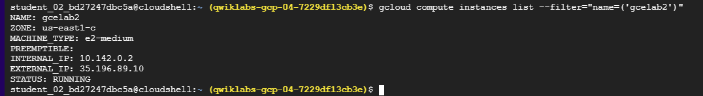
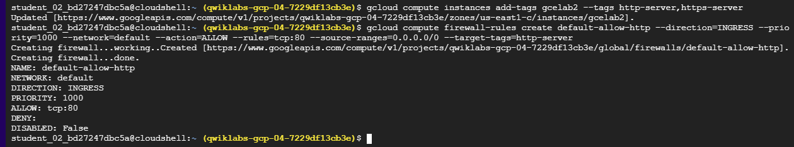

# Google Cloud Shell Hands-On Lab

## Overview

Cloud Shell provides command-line access to Google Cloud resources. It runs on a Debian-based virtual machine with a **persistent 5GB home directory** and includes pre-installed tools like the `gcloud` CLI. This hands-on lab walks you through using Cloud Shell to connect to Google Cloud resources and perform basic operations.

## What You'll Do

* Practice using `gcloud` commands
* Connect to Compute Engine resources on Google Cloud
* Configure environments using regions and zones

## Prerequisites

* Familiarity with Linux text editors like `vim`, `nano`, or `emacs`

## Setup and Requirements

* Use Chrome in **Incognito mode** to avoid login conflicts
* Do not use your personal Google Cloud account — use only the lab-provided credentials
* Labs are **timed and cannot be paused**
* Required: Stable internet connection and a modern browser

---

## Activate Cloud Shell

Click the **Activate Cloud Shell** icon in the top-right of the Cloud Console. Authorize API access if prompted. Once activated, your environment is ready and authenticated.

Verify setup:

```bash
gcloud auth list
gcloud config list project
```

---

## Task 1: Configuring Your Environment

### Understanding Regions and Zones

Resources in Google Cloud reside in **regions** and **zones**:

| Region         | Zones                                                              |
| -------------- | ------------------------------------------------------------------ |
| `us-west1`     | `us-west1-a`, `us-west1-b`                                         |
| `us-central1`  | `us-central1-a`, `us-central1-b`, `us-central1-c`, `us-central1-f` |
| `us-east1`     | `us-east1-b`, `us-east1-c`, `us-east1-d`                           |
| `europe-west1` | `europe-west1-b`, `europe-west1-c`, `europe-west1-d`               |
| `asia-east1`   | `asia-east1-a`, `asia-east1-b`, `asia-east1-c`                     |

Set region and zone:

```bash
gcloud config set compute/region us-east1
gcloud config set compute/zone us-east1-c
```


Verify:

```bash
gcloud config get-value compute/region
gcloud config get-value compute/zone
```


Set environment variables:

```bash
export PROJECT_ID=$(gcloud config get-value project)
export ZONE=$(gcloud config get-value compute/zone)
echo -e "PROJECT ID: $PROJECT_ID\nZONE: $ZONE"
```


---

## Task 2: Create a VM Instance

```bash
gcloud compute instances create gcelab2 --machine-type e2-medium --zone $ZONE
```


Check instance:

```bash
gcloud compute instances list
```

Help:

```bash
gcloud compute instances create --help
```

---

## Task 3: Filter CLI Output

List specific instance:

```bash
gcloud compute instances list --filter="name=('gcelab2')"
```


List all firewall rules:

```bash
gcloud compute firewall-rules list
```


List default network firewall rules:

```bash
gcloud compute firewall-rules list --filter="network='default'"
```


Filter rules for ICMP traffic:

```bash
gcloud compute firewall-rules list --filter="NETWORK:'default' AND ALLOW:'icmp'"
```


---

## Task 4: Connect to VM

SSH into the instance:

```bash
gcloud compute ssh gcelab2 --zone $ZONE
```

On the VM, install nginx:

```bash
sudo apt install -y nginx
```

Exit VM:

```bash
exit
```


---

## Task 5: Update Firewall to Allow HTTP

Tag the VM:

```bash
gcloud compute instances add-tags gcelab2 --tags http-server,https-server
```


Add firewall rule:

```bash
gcloud compute firewall-rules create default-allow-http \
--direction=INGRESS --priority=1000 --network=default \
--action=ALLOW --rules=tcp:80 --source-ranges=0.0.0.0/0 \
--target-tags=http-server
```


List updated firewall rule:

```bash
gcloud compute firewall-rules list --filter=ALLOW:'80'
```


Test HTTP connection:

```bash
curl http://$(gcloud compute instances list --filter=name:gcelab2 --format='get(networkInterfaces[0].accessConfigs[0].natIP)')
```

---

## Additional Resources

* [gcloud CLI Documentation](https://cloud.google.com/sdk/gcloud)
* [Compute Engine Regions & Zones](https://cloud.google.com/compute/docs/regions-zones)
