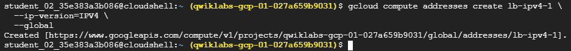

# Set Up Network and Application Load Balancers

This project demonstrates how to set up and configure both Network Load Balancers and Application Load Balancers on Google Cloud Platform using Compute Engine virtual machines (VMs).

## Overview

In this project, you will learn the differences between Network Load Balancers (Layer 4) and Application Load Balancers (Layer 7), and how to deploy them on GCP to distribute traffic across VM instances. You'll create multiple web servers, configure firewall rules, and verify traffic distribution using static IPs and health checks.

## Objectives

* Set the default region and zone for resources.
* Create multiple web server instances.
* Configure a Network Load Balancer.
* Set up traffic routing using a forwarding rule.
* Deploy an Application Load Balancer with managed instance groups.
* Test load balancer functionality.

# Load Balancer Lab Guide

## Task 1: Set the Default Region and Zone for All Resources

Setting a default region and zone simplifies the process of creating and managing Compute Engine resources by eliminating the need to specify them in each command.

**Set the default region:**

```bash
gcloud config set compute/region Region
```

This command sets the default region where resources will be created.

**Set the default zone:**

```bash
gcloud config set compute/zone Zone
```

This command sets the default zone within the region.


---

## Task 2: Create Multiple Web Server Instances

To simulate a load-balanced environment, create three VM instances and configure each with Apache HTTP Server to serve a unique web page.

### Create Web Server Instances

Each instance runs a startup script that installs Apache, starts the service, and creates a simple HTML page indicating the server name.

**Create VM `www1`:**

```bash
gcloud compute instances create www1 \
  --zone=Zone \
  --tags=network-lb-tag \
  --machine-type=e2-small \
  --image-family=debian-11 \
  --image-project=debian-cloud \
  --metadata=startup-script='#!/bin/bash
    apt-get update
    apt-get install apache2 -y
    service apache2 restart
    echo "<h3>Web Server: www1</h3>" | tee /var/www/html/index.html'
```


This creates a VM with a startup script to set up a basic web server.

Repeat similarly for the other two instances:

**Create VM `www2`:**

```bash
gcloud compute instances create www2 \
  --zone=Zone \
  --tags=network-lb-tag \
  --machine-type=e2-small \
  --image-family=debian-11 \
  --image-project=debian-cloud \
  --metadata=startup-script='#!/bin/bash
    apt-get update
    apt-get install apache2 -y
    service apache2 restart
    echo "<h3>Web Server: www2</h3>" | tee /var/www/html/index.html'
```


**Create VM `www3`:**

```bash
gcloud compute instances create www3 \
  --zone=Zone \
  --tags=network-lb-tag \
  --machine-type=e2-small \
  --image-family=debian-11 \
  --image-project=debian-cloud \
  --metadata=startup-script='#!/bin/bash
    apt-get update
    apt-get install apache2 -y
    service apache2 restart
    echo "<h3>Web Server: www3</h3>" | tee /var/www/html/index.html'
```


### Create a Firewall Rule

Allow HTTP traffic on port 80 to reach the VM instances:

```bash
gcloud compute firewall-rules create www-firewall-network-lb \
  --target-tags network-lb-tag --allow tcp:80
```


### Verify Instances

List VM instances and get their IP addresses:

```bash
gcloud compute instances list
```


Use `curl` to test each web server:

```bash
curl http://[IP_ADDRESS]
```

Replace `[IP_ADDRESS]` with the external IP of each VM.


---

## Task 3: Configure the Load Balancing Service

Set up a Layer 4 Network Load Balancer to distribute incoming traffic among your web server VMs.

### Create a Static External IP Address

Reserve a regional static IP:

```bash
gcloud compute addresses create network-lb-ip-1 \
  --region Region
```


### Create a Legacy HTTP Health Check

Checks the availability of backend instances:

```bash
gcloud compute http-health-checks create basic-check
```


### Create a Target Pool

Group the backend instances and associate the health check:

```bash
gcloud compute target-pools create www-pool \
  --region Region \
  --http-health-check basic-check
```


### Add Instances to the Pool

```bash
gcloud compute target-pools add-instances www-pool \
  --instances www1,www2,www3
```


### Create a Forwarding Rule

Define how traffic is directed to the load balancer:

```bash
gcloud compute forwarding-rules create www-rule \
  --region Region \
  --ports 80 \
  --address network-lb-ip-1 \
  --target-pool www-pool
```


---

## Task 4: Send Traffic to Your Instances

### Retrieve the Forwarding Rule IP Address

```bash
gcloud compute forwarding-rules describe www-rule --region Region
```


### Access the External IP with a Script

Store the IP address in a variable:

```bash
IPADDRESS=$(gcloud compute forwarding-rules describe www-rule --region Region --format="json" | jq -r .IPAddress)
echo $IPADDRESS
```

### Send Traffic with `curl`

Test load balancing by repeatedly sending requests:

```bash
while true; do curl -m1 $IPADDRESS; done
```

Use `Ctrl + C` to stop.


---

## Task 5: Create an Application Load Balancer

Use a Layer 7 Load Balancer to distribute traffic based on content.

### Create an Instance Template

Defines the VM configuration:

```bash
gcloud compute instance-templates create lb-backend-template \
  --region=Region \
  --network=default \
  --subnet=default \
  --tags=allow-health-check \
  --machine-type=e2-medium \
  --image-family=debian-11 \
  --image-project=debian-cloud \
  --metadata=startup-script='#!/bin/bash
    apt-get update
    apt-get install apache2 -y
    a2ensite default-ssl
    a2enmod ssl
    vm_hostname="$(curl -H "Metadata-Flavor:Google" http://169.254.169.254/computeMetadata/v1/instance/name)"
    echo "Page served from: $vm_hostname" | tee /var/www/html/index.html
    systemctl restart apache2'
```

### Create a Managed Instance Group

```bash
gcloud compute instance-groups managed create lb-backend-group \
  --template=lb-backend-template --size=2 --zone=Zone
```


### Allow Health Check Firewall Rule

Allow health check probes:

```bash
gcloud compute firewall-rules create fw-allow-health-check \
  --network=default \
  --action=allow \
  --direction=ingress \
  --source-ranges=130.211.0.0/22,35.191.0.0/16 \
  --target-tags=allow-health-check \
  --rules=tcp:80
```


### Reserve a Global IP Address

```bash
gcloud compute addresses create lb-ipv4-1 \
  --ip-version=IPV4 \
  --global
```


### Get the IP Address

```bash
gcloud compute addresses describe lb-ipv4-1 \
  --format="get(address)" \
  --global
```

### Create a Health Check

```bash
gcloud compute health-checks create http http-basic-check \
  --port 80
```


### Create a Backend Service

```bash
gcloud compute backend-services create web-backend-service \
  --protocol=HTTP \
  --port-name=http \
  --health-checks=http-basic-check \
  --global
```

### Add Instance Group to Backend

```bash
gcloud compute backend-services add-backend web-backend-service \
  --instance-group=lb-backend-group \
  --instance-group-zone=Zone \
  --global
```

### Create a URL Map

```bash
gcloud compute url-maps create web-map-http \
  --default-service web-backend-service
```

### Create Target HTTP Proxy

```bash
gcloud compute target-http-proxies create http-lb-proxy \
  --url-map web-map-http
```

### Create Global Forwarding Rule

```bash
gcloud compute forwarding-rules create http-content-rule \
  --address=lb-ipv4-1 \
  --global \
  --target-http-proxy=http-lb-proxy \
  --ports=80
```

---

## Task 6: Test Traffic Sent to Your Instances

### Verify Load Balancer Health

In the Google Cloud Console:

1. Go to **Load balancing**.
2. Select the **web-map-http** load balancer.
3. Check that backend VMs are marked **Healthy**.

### Test the Load Balancer in a Web Browser

Visit:

```
http://[IP_ADDRESS]
```

Replace `[IP_ADDRESS]` with your global static IP. The output should be:

```
Page served from: lb-backend-group-xxxx
```


---

## 🎉 Congratulations!

You've successfully built:

* A **Network Load Balancer** using unmanaged VMs and target pools.
* An **Application Load Balancer** using a managed instance group and HTTP proxy.
