# 🌥️ Cloud Monitoring: Qwik Start — README

This lab introduces **Google Cloud Monitoring and Logging** by guiding you through the setup and observation of a basic LAMP virtual machine. You will learn how to deploy a Compute Engine VM, install monitoring agents, create uptime checks, configure alerting policies, and visualize metrics in a custom dashboard.

---

## 🧾 Lab Overview

### Lab Objectives:

1. Deploy a VM with Apache installed.
2. Enable monitoring and logging agents.
3. Create uptime checks and alert policies.
4. Build a monitoring dashboard.
5. Explore logs and incident alerts.

---

## ✅ Task 1: Create a Compute Engine Instance

### Steps:

1. Go to **Navigation Menu > Compute Engine > VM Instances**.
2. Click **Create Instance**.
3. Fill in the following fields:

   * **Name**: `lamp-1-vm`
   * **Region**: `<REGION>` (your lab-assigned region)
   * **Zone**: `<ZONE>`
   * **Series**: `E2`
   * **Machine type**: `e2-medium`
4. Under **Boot Disk**, choose:

   * **OS**: Debian GNU/Linux 12 (bookworm)
5. Under **Firewall**, check:

   * **Allow HTTP traffic**
6. Click **Create**.

### Result:

A VM instance named `lamp-1-vm` is launched and is publicly accessible over HTTP.

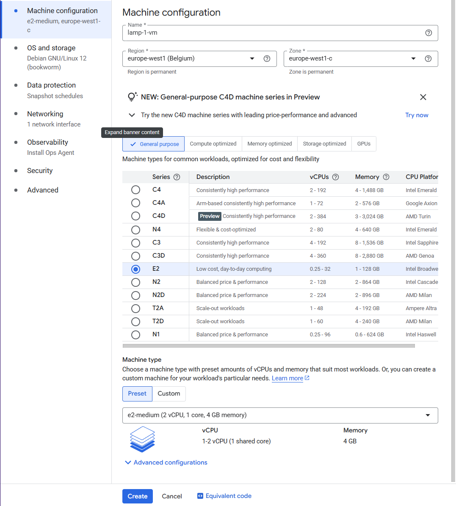
---

## ✅ Task 2: Install Apache2 Web Server

1. Click **SSH** next to the `lamp-1-vm` instance to open a terminal.
2. Run the following commands to install Apache and PHP:

   ```bash
   sudo apt-get update
   sudo apt-get install apache2 php7.0
   sudo service apache2 restart
   ```

   > ⚠️ If PHP 7.0 is not available, use `php5` instead.
3. Return to VM Instances in the Console.
4. Click the **External IP** to see the Apache default page.

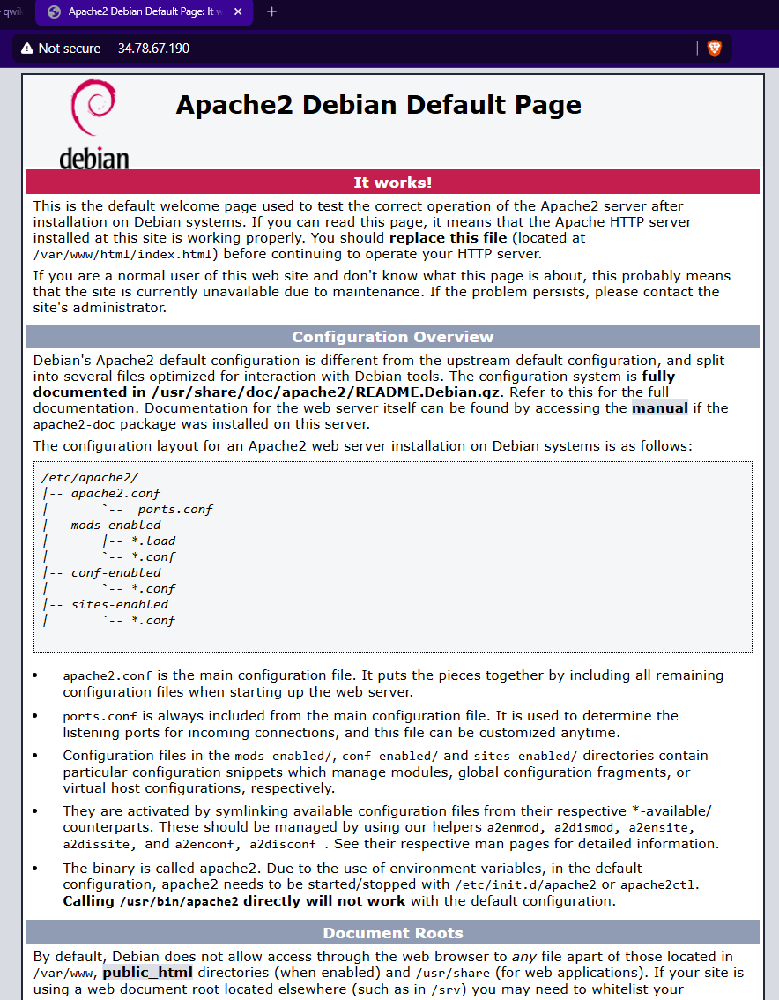
---

## ✅ Task 3: Create Monitoring Metrics Scope

1. Navigate to **Observability > Monitoring** from the Console.
2. A **Monitoring Workspace** is created automatically for your current project.

   * This enables Cloud Monitoring features such as metrics, dashboards, alerts, etc.

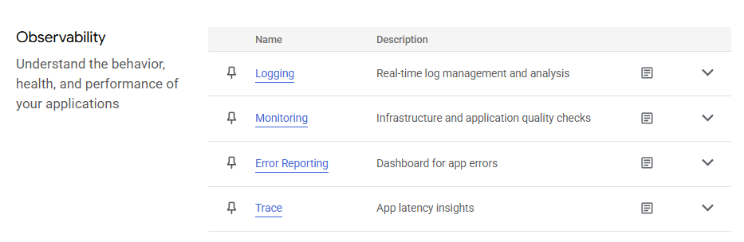
---

## ✅ Task 4: Install Monitoring and Logging Agents

### Why install agents?

These agents collect system-level and application-level metrics and logs.

### Steps:

1. Connect to `lamp-1-vm` via SSH.

2. Run the following commands:

   ```bash
   curl -sSO https://dl.google.com/cloudagents/add-google-cloud-ops-agent-repo.sh
   sudo bash add-google-cloud-ops-agent-repo.sh --also-install
   ```

3. Check the agent status:

   ```bash
   sudo systemctl status google-cloud-ops-agent"*"
   ```

   > Press `q` to exit the status screen.

4. Run final update:

   ```bash
   sudo apt-get update
   ```

---

## ✅ Task 5: Create an Uptime Check

1. In **Cloud Monitoring**, go to **Uptime Checks > Create Uptime Check**.
2. Configure:

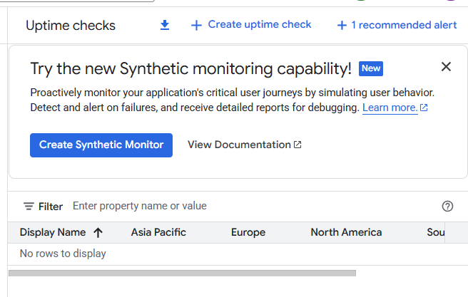

   * **Protocol**: HTTP
   * **Resource Type**: Instance
   * **Instance**: `lamp-1-vm`
   * **Frequency**: 1 minute
3. Click **Continue** through all steps.
4. Name it `Lamp Uptime Check`.
5. Click **Test** to confirm it works.
6. Click **Create**.

> Uptime checks simulate periodic requests to your resource to verify it's available and responsive.

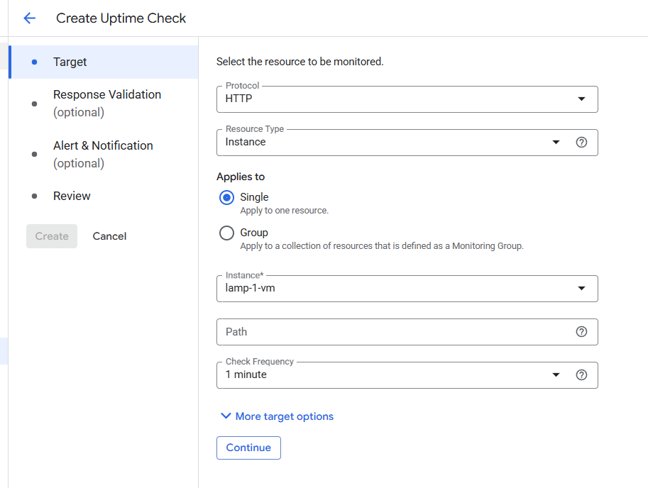
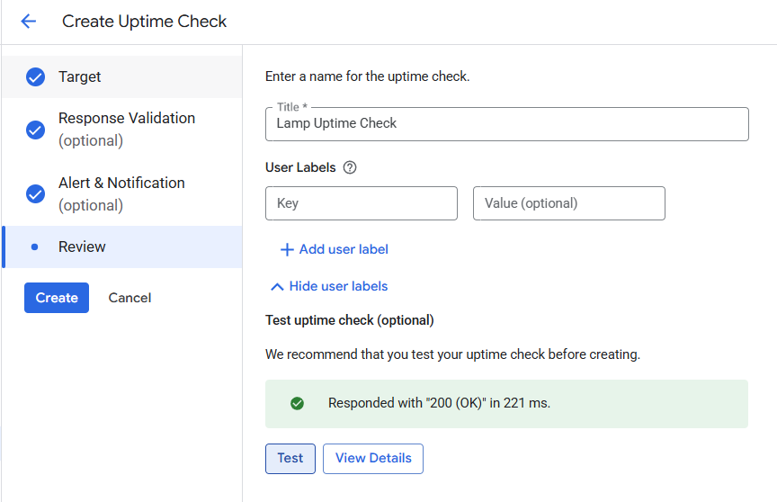
---

## ✅ Task 6: Create an Alerting Policy

1. Navigate to **Monitoring > Alerting > +Create Policy**.
2. Select a metric:

   * Type **"Network traffic"**
   * Choose: `VM instance > Interface > Network traffic`

   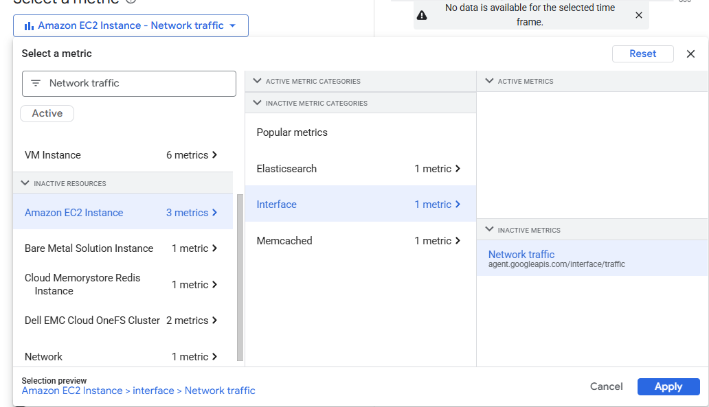
3. Configure conditions:

   * **Threshold**: Above `500`
   * **Retest window**: 1 minute
4. Set up **Notification Channels**:

   * Click **Manage Notification Channels**
   * Scroll to **Email** and click **Add New**
   * Enter your email and a display name
   * Click **Save** and return to the policy setup
5. Add documentation message and name it `Inbound Traffic Alert`.
6. Click **Create Policy**.

> 🎯 An alerting policy notifies you when a monitored metric crosses a threshold. Useful for catching performance or availability issues early.

---

## ✅ Task 7: Create a Dashboard with Charts

1. Navigate to **Monitoring > Dashboards > +Create Custom Dashboard**.
2. Name it: `Cloud Monitoring LAMP Qwik Start Dashboard`.

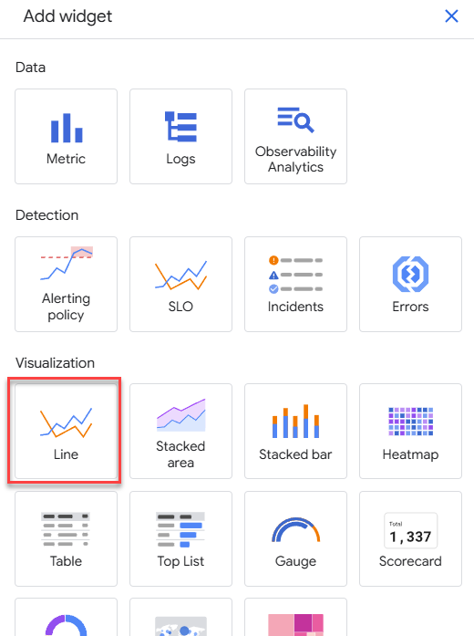
### Add Widget 1:

* Click **+ Add Widget**
* **Type**: Line
* **Title**: `CPU Load`
* **Metric**: `VM instance > Cpu > CPU load (1m)`

### Add Widget 2:

* Click **+ Add Widget**
* **Type**: Line
* **Title**: `Received Packets`
* **Metric**: `VM instance > Instance > Received packets`

> 📊 Dashboards help visualize resource health in real-time.

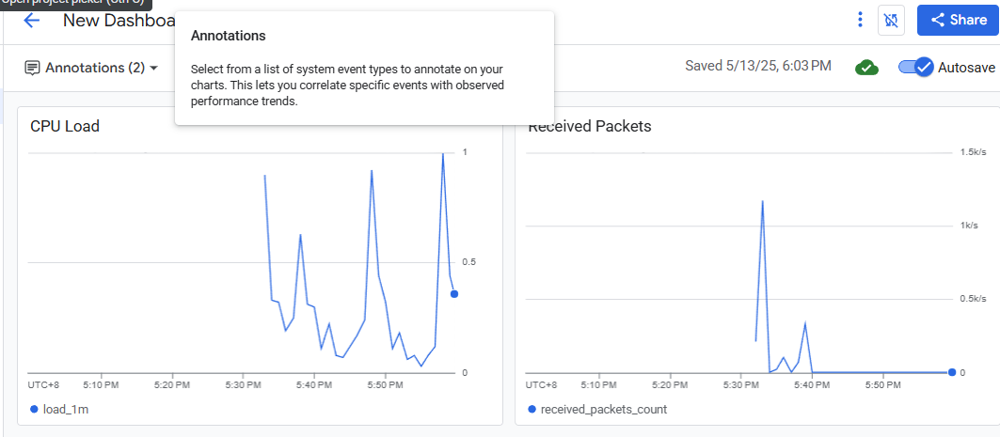
---

## ✅ Task 8: View Logs in Logs Explorer

1. Navigate to **Logging > Logs Explorer**.
2. Filter logs:

   * Resource Type: **VM Instance**
   * VM: `lamp-1-vm`
3. Click **Apply** to view logs.

### Observe Instance Lifecycle

* In a separate browser window, stop and start the instance.
* Watch log entries update in **Logs Explorer** as the instance changes state.

> 📝 Cloud Logging captures detailed logs like system events, application logs, and agent-generated messages.

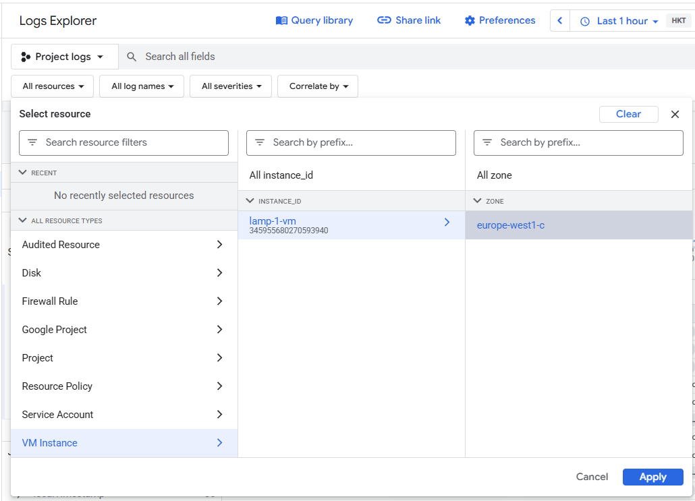
---

## ✅ Task 9: Review Uptime and Alerts

1. Navigate to **Monitoring > Uptime Checks**.
2. Click on `Lamp Uptime Check`.

   * After the VM restart, regions may initially show as failed. Wait for them to recover.
3. Go to **Alerting > Incidents** to view triggered alerts.
4. Check your email inbox for alert notifications.

   * ⚠️ Tip: Remove the email channel after the lab to stop receiving alerts.
   
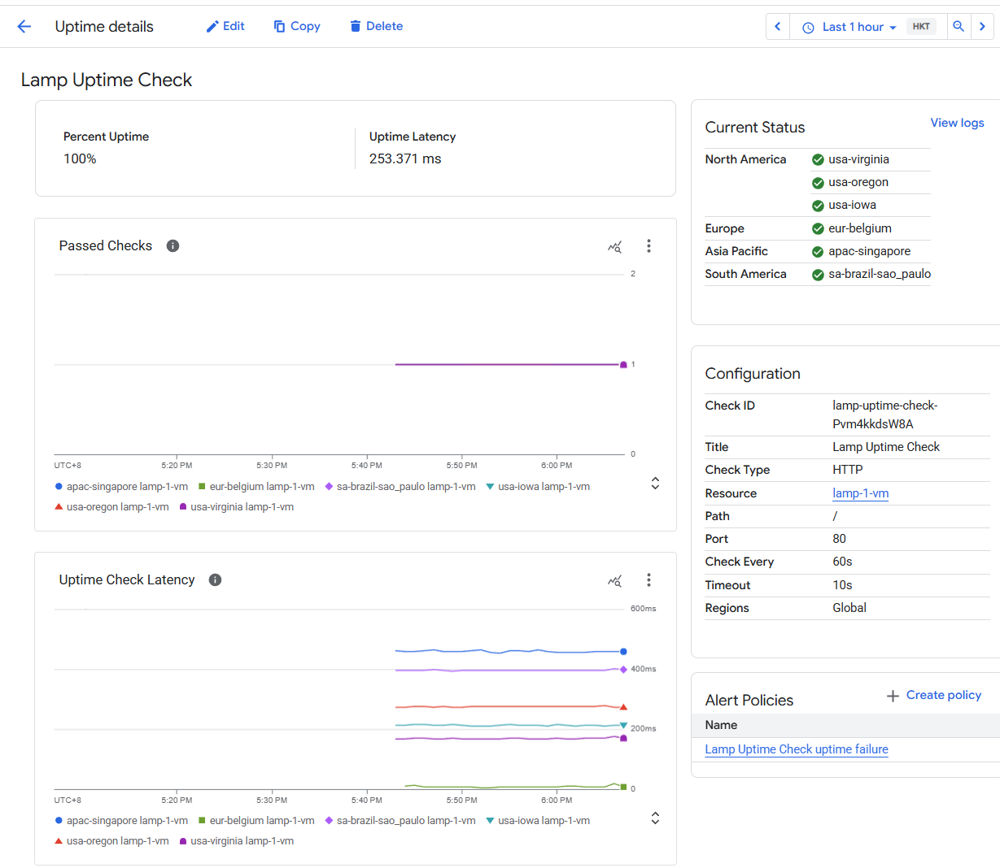
---

## 🏁 Conclusion

🎉 Congratulations! You've:

* Launched and configured a VM
* Installed Apache and verified HTTP access
* Set up and configured Monitoring & Logging agents
* Created uptime checks and alerting policies
* Built a real-time dashboard with metric visualizations
* Explored logs and verified alert behavior

---

## 📚 Additional Learning Resources

* [Cloud Monitoring Documentation](https://cloud.google.com/monitoring/docs)
* [Cloud Logging Overview](https://cloud.google.com/logging/docs)
* [Monitoring Agent Metrics List](https://cloud.google.com/monitoring/agent/metrics)
* [Alerting Policies and Notifications](https://cloud.google.com/monitoring/alerts)
