# ☁️ Cloud Storage: Qwik Start – CLI/SDK

This project is based on the **Google Cloud Skill Boosts lab**: *Cloud Storage: Qwik Start – CLI/SDK*. In this lab, you'll use Google Cloud's CLI and SDK tools to interact with **Cloud Storage** for basic operations like creating buckets, uploading files, managing folders, and setting public access permissions.

---

## 📘 Overview

Google Cloud Storage enables the world-wide storage and retrieval of any amount of data at any time. It supports scenarios such as:

- Serving website content
- Storing data for archival or disaster recovery
- Distributing large objects via direct download

In this lab, you'll learn to use the **Google Cloud command line interface (gcloud)** and **gsutil** to interact with Cloud Storage.

---

## 🎯 What You'll Do

By the end of this lab, you will:

1. Create a Cloud Storage bucket
2. Upload an object into the bucket
3. Download the object
4. Create folders in the bucket
5. List contents of the bucket
6. Retrieve object metadata
7. Make an object publicly accessible
8. Remove public access
9. Delete objects

All tasks are performed using Cloud Shell or your local CLI with the Google Cloud SDK.

---

## 🧰 Prerequisites

- Access to [Google Cloud Console](https://console.cloud.google.com/)
- Cloud Shell or installed [gcloud CLI](https://cloud.google.com/sdk/docs/install)
- A billing-enabled Google Cloud project

---

## 🪣 Task 1: Create a Bucket

> 📝 Bucket Naming Rules:
> - Lowercase only, 3–63 characters
> - No sensitive info
> - Must not begin with "goog"
> - Must not look like an IP address

```bash
gcloud storage buckets create gs://<YOUR-BUCKET-NAME>
```
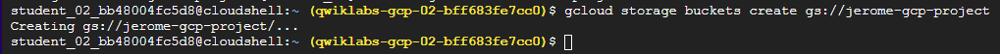

> 🔍 View bucket settings via:
> **Console > Navigation menu > Cloud Storage > \[Bucket Name] > Configuration**

If the name is taken, you'll see an error and must choose a different one.

---

## 🖼 Task 2: Upload an Object into Your Bucket

Download and upload the image:

```bash
curl https://upload.wikimedia.org/wikipedia/commons/thumb/a/a4/Ada_Lovelace_portrait.jpg/800px-Ada_Lovelace_portrait.jpg --output ada.jpg
gcloud storage cp ada.jpg gs://<YOUR-BUCKET-NAME>
rm ada.jpg
```
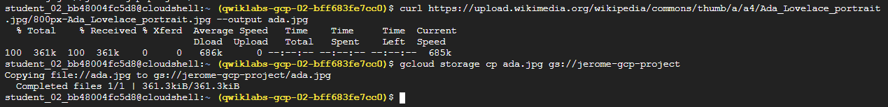

---

## 📥 Task 3: Download an Object

```bash
gcloud storage cp -r gs://<YOUR-BUCKET-NAME>/ada.jpg .
```
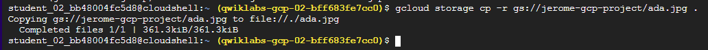

---

## 🗂 Task 4: Copy Object to a Folder

Create a folder and copy the image:

```bash
gcloud storage cp gs://<YOUR-BUCKET-NAME>/ada.jpg gs://<YOUR-BUCKET-NAME>/image-folder/
```

Folders in Cloud Storage are **logical prefixes**; not actual directories.
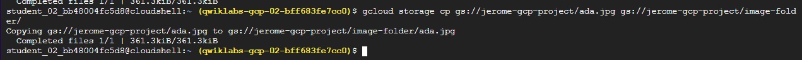
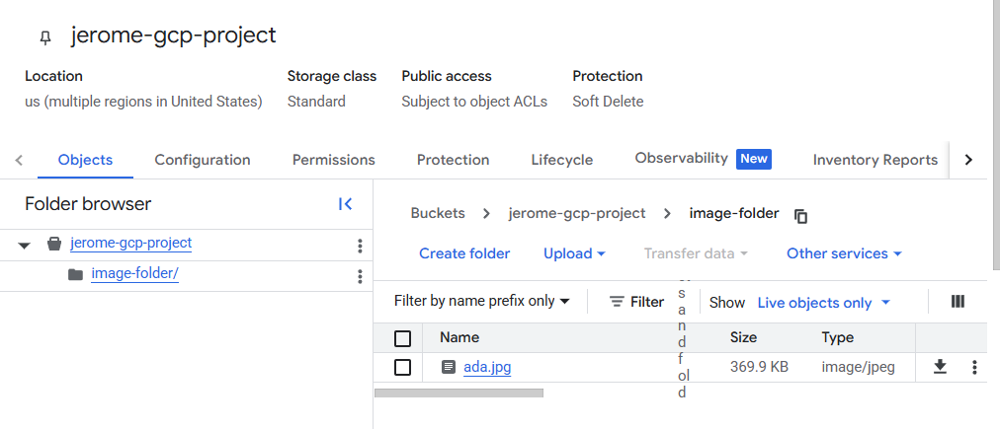

---

## 📄 Task 5: List Bucket Contents

```bash
gcloud storage ls gs://<YOUR-BUCKET-NAME>
```
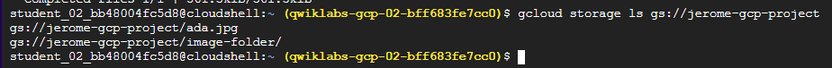

---

## 📊 Task 6: List Object Details

```bash
gcloud storage ls -l gs://<YOUR-BUCKET-NAME>/ada.jpg
```
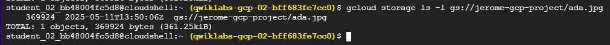

---

## 🌐 Task 7: Make Object Publicly Accessible

```bash
gsutil acl ch -u AllUsers:R gs://<YOUR-BUCKET-NAME>/ada.jpg
```
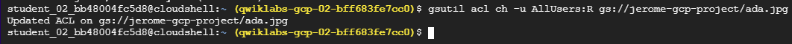

Verify via browser:

```
https://storage.googleapis.com/<YOUR-BUCKET-NAME>/ada.jpg
```
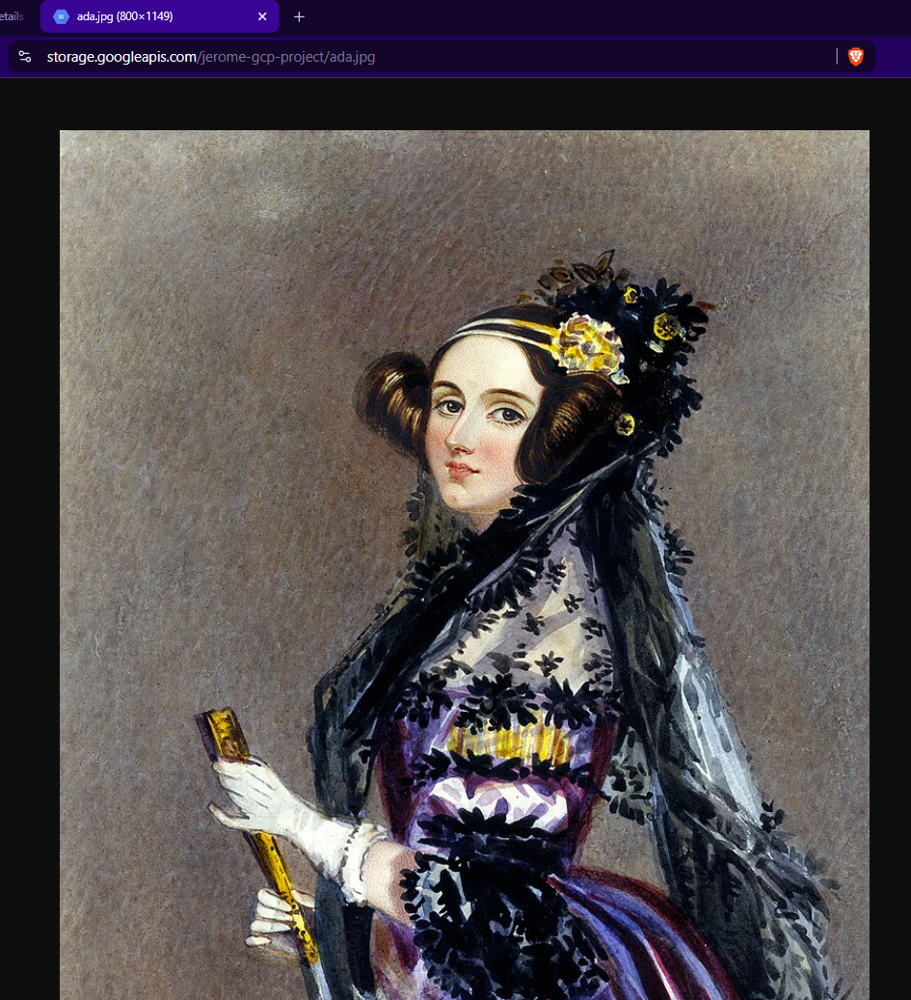

---

## 🔐 Task 8: Remove Public Access

```bash
gsutil acl ch -d AllUsers gs://<YOUR-BUCKET-NAME>/ada.jpg
```
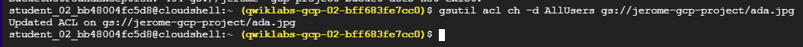
---

## 🧹 Task 9: Delete an Object

```bash
gcloud storage rm gs://<YOUR-BUCKET-NAME>/ada.jpg
```
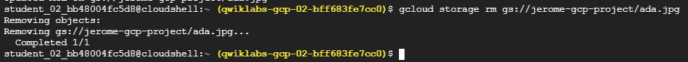

> Note: This deletes only the original file.
> The file in `image-folder/` still exists unless deleted manually.

---

## 👩‍🔬 Bonus: Who Is Ada Lovelace?

Ada Lovelace is considered the **first computer programmer**. She worked with Charles Babbage on the Analytical Engine, and her notes are recognized as the **first algorithm intended for a machine**.

📷 **Image source citation**:
[Ada Lovelace on Wikimedia Commons](https://commons.wikimedia.org/wiki/File:Ada_Lovelace_portrait.jpg)

---

## 🔗 References

* [Google Cloud Storage Documentation](https://cloud.google.com/storage/docs/)
* [gcloud CLI Reference](https://cloud.google.com/sdk/gcloud)
* [gsutil Tool Guide](https://cloud.google.com/storage/docs/gsutil)

```

---
