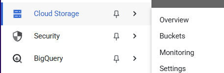
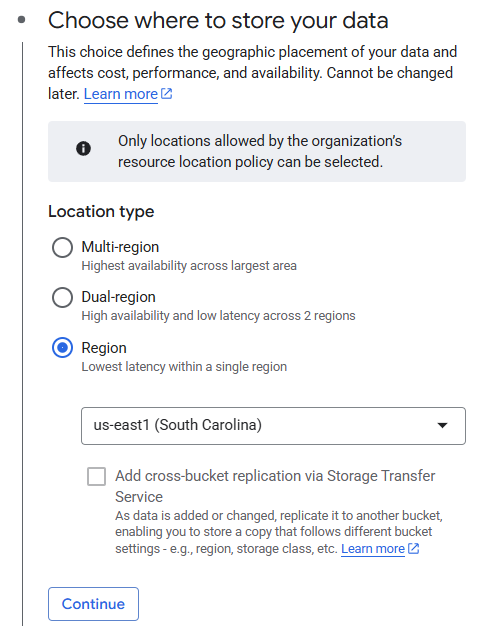
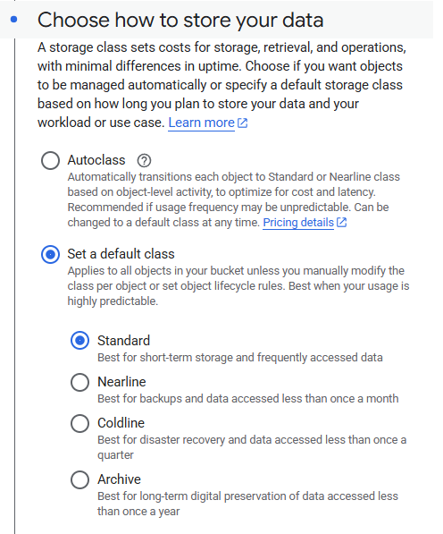
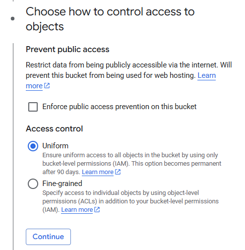

# ☁️ Google Cloud Storage: Qwik Start (Console)

This repository documents the steps to complete the **Google Cloud Storage Qwiklab** using the Cloud Console. In this lab, you'll create a Cloud Storage bucket, upload and share objects, organize folders, and set public access permissions.

---

## 🚀 What You'll Do

* Create a Cloud Storage bucket
* Upload objects to the bucket
* Make objects publicly accessible
* Create folders and subfolders
* Delete folders

---

## ✅ Lab Steps

### 1. **Create a Bucket**

1. Go to **Navigation menu > Cloud Storage > Buckets**



2. Click **+ Create**
3. Fill in the required fields:

   * **Name**: Use your **Project ID** (it's globally unique)
   * **Location type**: Choose **Region**

   

   * **Location**: Use the region given at lab start
   * **Storage class**: Standard

   

   * **Access control**: Uniform
   * **Uncheck**: *Enforce public access prevention*

   

4. Click **Create**

### 2. **Upload an Object**


1. Download this image above: *(save as `kitten.png`)*
2. Click the name of your bucket
3. Click **Upload > Upload files**
4. Select `kitten.png`
5. If needed, rename the file to `kitten.png` using the 3-dot menu

### 3. **Make the Object Public**

1. Go to the **Permissions** tab of the bucket
2. Click **Grant Access**
3. Under **New principals**, enter `allUsers`
4. Select role: **Cloud Storage > Storage Object Viewer**
5. Click **Save**, then confirm **Allow public access**
6. Go back to **Objects**, confirm the file is marked as `Public to internet`
7. Click **Copy URL** to view the image in a browser

Example:

```
https://storage.googleapis.com/YOUR_BUCKET_NAME/kitten.png
```

### 4. **Create Folders**

1. In the **Objects** tab, click **Create folder** → name it `folder1`
2. Click `folder1` → **Create folder** again → name it `folder2`
3. Click `folder2` → **Upload > Upload files** → select a file

### 5. **Delete the Folder or Bucket**

1. Return to the **buckets list**
2. Select your bucket
3. Click **Delete**
4. Type `DELETE` to confirm and remove the bucket, including all objects and folders

---

## 📝 Notes

* Bucket names are **globally unique**
* Object names must be unique **within a bucket**
* Public URLs follow this format:

  ```
  https://storage.googleapis.com/BUCKET_NAME/OBJECT_NAME
  ```

---

## 📚 Resources

* [Google Cloud Storage Documentation](https://cloud.google.com/storage/docs/)
* [Qwiklabs: Cloud Storage Qwik Start Lab](https://www.cloudskillsboost.google)

---